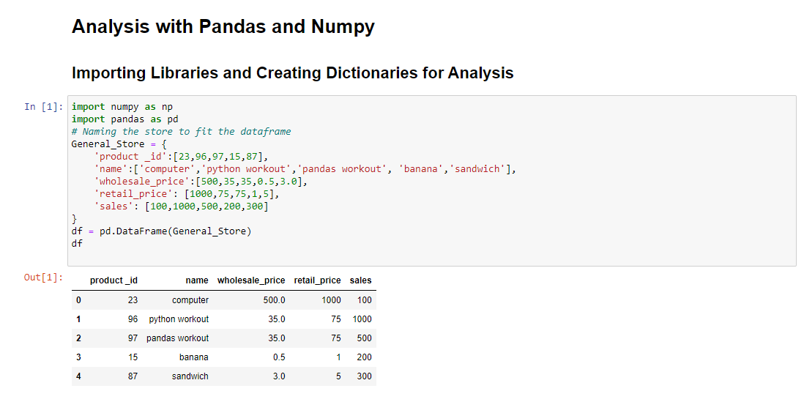
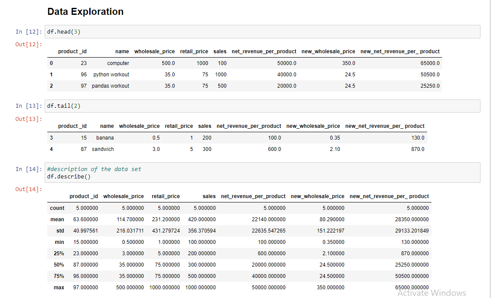
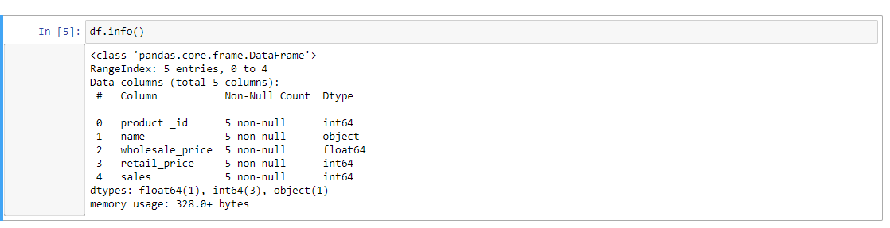
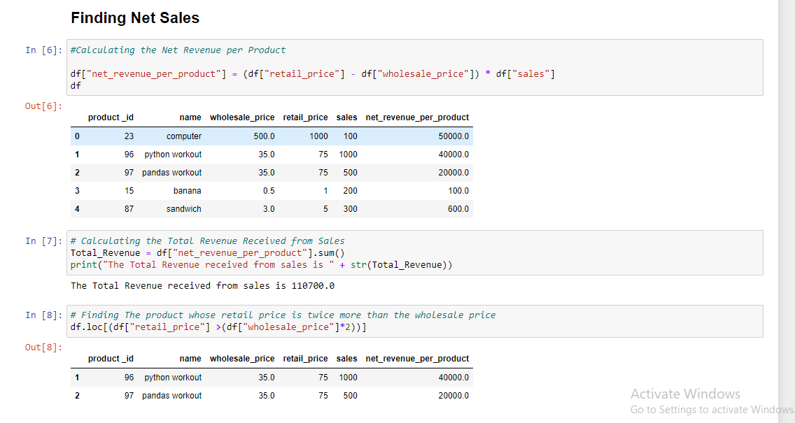
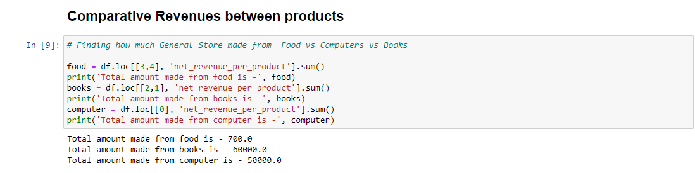
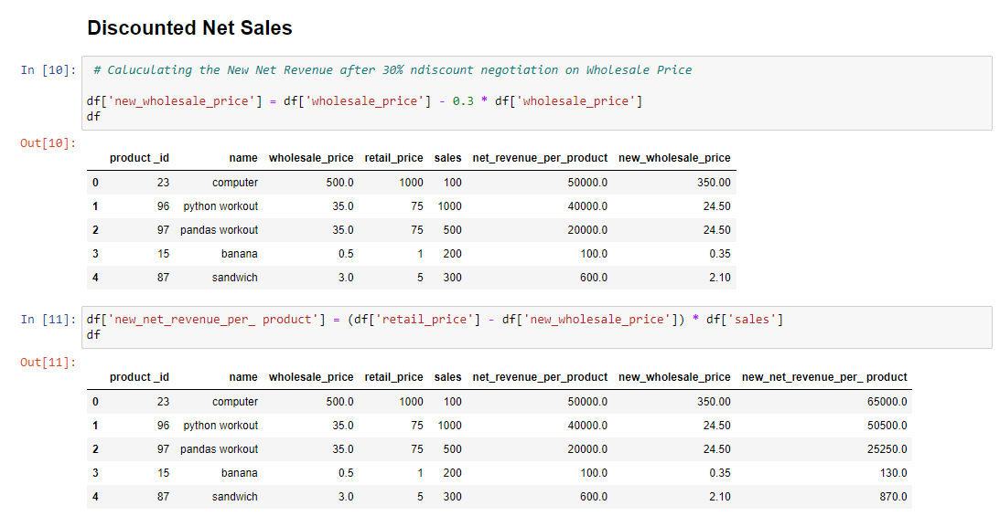

# Numpy-and-Pandas-Analysis
Analyzing Dataset with Numpy and Pandas Libraries

This code  seeks to explore how numpy and pandas libraries to could be used  in analyzing a given dataset of a general store with different variables and lists

## Importing  Libraries

## Exploring the Dataset
With the dataset already loaded, we need to explore the data set to know the various columns and rows, description of the dataset  etc.

## Finding Net Sales
With revenue being the same as Sales, this code tries to find the revenue that was made per product, the revenue that was accrued due to sales and the product whose retail price was twice more than it wholesale price

## Comparing Revenue from Products
This codes seeks to help us compare revenues from various product sales in order to ascertain the performance of the various products

## Discounted Net Sales
Given the situation of a negotiation for a discount, we try to find out how the figures will pan out if the discounts were applied so as to ascertain the new net revenue per product.
